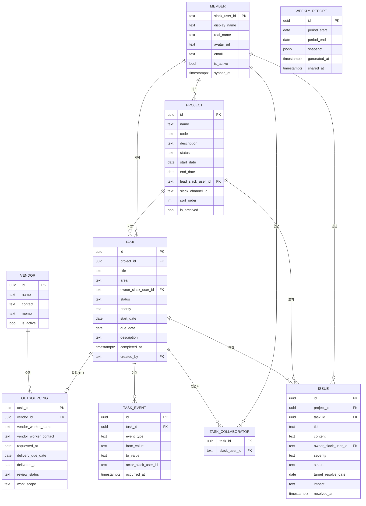

# 03. 데이터 모델

## 3.1 ERD



## 3.2 엔터티 정의

### MEMBER — 구성원 (Slack 미러)

Slack Workspace 멤버의 **캐시**다. KinderFlow에서 직접 생성/수정하지 않는다.

| 필드 | 타입 | 필수 | 설명 |
|---|---|---|---|
| `slack_user_id` | text | ✔ | PK. Slack User ID (`U01ABCDEF`) |
| `display_name` | text | ✔ | Slack 표시 이름 |
| `real_name` | text | | Slack 실명 |
| `avatar_url` | text | | 프로필 이미지 (`image_72`) |
| `email` | text | | Slack 프로필 이메일 |
| `is_active` | bool | ✔ | 비활성(퇴사·삭제) 처리. 기본 `true` |
| `synced_at` | timestamptz | ✔ | 마지막 동기화 시각 |

- 봇·앱 계정(`is_bot`)과 `deleted` 사용자는 동기화 대상에서 제외한다.
- 비활성 멤버는 **삭제하지 않는다.** 과거 업무의 담당 기록이 유지되어야 한다.
- 신규 담당자 선택 목록에는 `is_active = true`만 노출한다.

### PROJECT — 프로젝트

| 필드 | 타입 | 필수 | 설명 |
|---|---|---|---|
| `id` | uuid | ✔ | PK |
| `name` | text | ✔ | 프로젝트명 (예: Kinderverse) |
| `code` | text | | 짧은 식별자 (예: KV). 리포트·알림 표기용 |
| `description` | text | | 설명 |
| `status` | enum | ✔ | `PLANNED` 예정 / `ACTIVE` 진행중 / `ON_HOLD` 보류 / `DONE` 완료 |
| `start_date` | date | | 시작일 |
| `end_date` | date | | 종료 예정일 |
| `lead_slack_user_id` | text FK | | 프로젝트 리드 |
| `slack_channel_id` | text | | 프로젝트 알림 채널. 미설정 시 기본 채널 사용 |
| `sort_order` | int | | Overview 정렬 순서 |
| `is_archived` | bool | ✔ | 기본 `false`. 아카이브 시 목록·집계에서 제외 |

### TASK — 업무 (기본 관리 단위)

| 필드 | 타입 | 필수 | 설명 |
|---|---|---|---|
| `id` | uuid | ✔ | PK |
| `project_id` | uuid FK | ✔ | 소속 프로젝트 |
| `title` | text | ✔ | 업무명 |
| `area` | enum | ✔ | 업무 영역 (`PLAN`/`DEV`/`CONTENT`/`BIZ`/`OPS`/`OUT`/`ETC`) |
| `owner_slack_user_id` | text FK | ✔ | **담당자. 단일 값** |
| `status` | enum | ✔ | 업무 상태. 기본 `TODO`(외주는 `REQUEST_PLANNED`) |
| `priority` | enum | | `HIGH` 높음 / `NORMAL` 보통 / `LOW` 낮음. 기본 `NORMAL` |
| `start_date` | date | | 시작일 |
| `due_date` | date | ✔ | 마감일 |
| `description` | text | | 업무 설명 |
| `completed_at` | timestamptz | | 완료 처리 시각. 상태가 `DONE`이 될 때 기록 |
| `created_by` | text FK | ✔ | 등록자 |
| `created_at` / `updated_at` | timestamptz | ✔ | |

**제약**
- `owner_slack_user_id`는 NOT NULL — 담당자 없는 업무는 생성할 수 없다. (원칙 1)
- `project_id`는 NOT NULL — 프로젝트 없는 업무는 생성할 수 없다. (원칙 2)
- `start_date`가 있으면 `start_date <= due_date`.
- `area = 'OUT'` ⇔ `OUTSOURCING` 레코드 존재 (양방향 필수).

### TASK_COLLABORATOR — 협업자

| 필드 | 타입 | 필수 | 설명 |
|---|---|---|---|
| `task_id` | uuid FK | ✔ | PK (복합) |
| `slack_user_id` | text FK | ✔ | PK (복합) |
| `added_at` | timestamptz | ✔ | |

- 담당자를 협업자로 중복 등록할 수 없다.
- 협업자 수 상한 없음. 단 UI는 5명 초과 시 `+N` 으로 축약 표기.

### VENDOR — 외주 업체

| 필드 | 타입 | 필수 | 설명 |
|---|---|---|---|
| `id` | uuid | ✔ | PK |
| `name` | text | ✔ | 업체명 (예: OO 디자인) |
| `contact` | text | | 대표 연락처·이메일 |
| `memo` | text | | 비고 |
| `is_active` | bool | ✔ | 기본 `true` |

- MVP에서는 외주 등록 시 업체명을 **직접 입력**하되, 기존 업체명이 있으면 자동완성으로 재사용한다.

### OUTSOURCING — 외주 상세 (TASK 1:1 확장)

| 필드 | 타입 | 필수 | 설명 |
|---|---|---|---|
| `task_id` | uuid FK | ✔ | PK. TASK와 1:1 |
| `vendor_id` | uuid FK | ✔ | 외주 업체 |
| `vendor_worker_name` | text | | 외부 작업자명 (예: 홍길동) |
| `vendor_worker_contact` | text | | 외부 작업자 연락처 |
| `work_scope` | text | | 작업 내용 |
| `requested_at` | date | | 요청일 |
| `delivery_due_date` | date | ✔ | 납품 예정일 |
| `delivered_at` | date | | 실제 납품일 |
| `review_status` | enum | ✔ | `NOT_STARTED` 미검수 / `IN_REVIEW` 검수중 / `APPROVED` 승인 / `REJECTED` 반려. 기본 `NOT_STARTED` |

- **내부 담당자 = `task.owner_slack_user_id`** 이다. 별도 필드를 두지 않는다.
  (외주도 "이 업무를 누가 담당하는가"의 답은 내부 담당자다 — 원칙 1·5)
- `task.due_date`와 `delivery_due_date`의 관계: 납품 예정일이 곧 업무 마감일이 되는 경우가 많으므로,
  외주 등록 시 `delivery_due_date` 입력값을 `due_date`의 기본값으로 채운다. 이후 개별 수정 가능.

### ISSUE — 이슈

| 필드 | 타입 | 필수 | 설명 |
|---|---|---|---|
| `id` | uuid | ✔ | PK |
| `project_id` | uuid FK | ✔ | 관련 프로젝트 |
| `task_id` | uuid FK | | 관련 업무 (선택) |
| `title` | text | ✔ | 이슈명 |
| `content` | text | ✔ | 내용 |
| `owner_slack_user_id` | text FK | ✔ | 이슈 담당자 |
| `severity` | enum | ✔ | `HIGH` 높음 / `NORMAL` 보통 / `LOW` 낮음. 기본 `NORMAL` |
| `status` | enum | ✔ | `OPEN` → `CHECKING` 확인중 → `RESOLVED` 해결. 기본 `OPEN` |
| `target_resolve_date` | date | | 해결 목표일 |
| `impact` | text | | 영향 (예: 콘텐츠 등록 일정 3일 지연 예상) |
| `resolved_at` | timestamptz | | 해결 처리 시각 |
| `created_by` | text FK | ✔ | 등록자 |

- `task_id`가 지정되면 해당 업무에 🔥 이슈 플래그가 표시된다.
- 외주 관련 이슈도 동일 테이블에서 관리한다. 외주 업체 정보는 연결된 업무에서 조회한다.

### TASK_EVENT — 업무 이력

Weekly Report의 "이번 주 변화"를 사람 입력 없이 계산하기 위한 최소 이력이다. (원칙 8)

| 필드 | 타입 | 필수 | 설명 |
|---|---|---|---|
| `id` | uuid | ✔ | PK |
| `task_id` | uuid FK | ✔ | |
| `event_type` | enum | ✔ | `CREATED` / `STATUS_CHANGED` / `OWNER_CHANGED` / `DUE_CHANGED` / `REVIEW_STATUS_CHANGED` |
| `from_value` | text | | 변경 전 값 |
| `to_value` | text | | 변경 후 값 |
| `actor_slack_user_id` | text | ✔ | 변경자 |
| `occurred_at` | timestamptz | ✔ | |

### WEEKLY_REPORT — 주간 리포트

| 필드 | 타입 | 필수 | 설명 |
|---|---|---|---|
| `id` | uuid | ✔ | PK |
| `period_start` / `period_end` | date | ✔ | 집계 기간 (월~일) |
| `snapshot` | jsonb | ✔ | 생성 시점 집계 결과 전체 |
| `generated_at` | timestamptz | ✔ | 생성 시각 |
| `shared_at` | timestamptz | | Slack 공유 시각 |
| `generated_by` | text | | 자동 생성은 `system` |

- 리포트는 **생성 시점 스냅샷을 저장**한다. 이후 업무 데이터가 바뀌어도 지난 리포트는 변하지 않는다.

## 3.3 상태값 정의

### 업무 상태 — 일반 업무

```
TODO(대기) → IN_PROGRESS(진행중) → REVIEW(검토) → DONE(완료)
```

### 업무 상태 — 외주 작업 (`area = OUT`)

```
REQUEST_PLANNED(요청 예정) → REQUESTED(요청 완료) → OUT_IN_PROGRESS(작업중)
   → OUT_REVIEW(검수) → OUT_REVISION(수정) → DONE(완료)
```

- 일반 업무와 외주 업무는 **같은 `status` 컬럼**을 쓰되 허용 값 집합이 다르다.
- 집계 시 두 체계를 공통 단계로 매핑한다. (§3.5)

### 플래그 — 상태가 아님

| 플래그 | 표기 | 판정 |
|---|---|---|
| 지연 | ⚠ | `status ≠ DONE` **AND** `due_date < 오늘` |
| 이슈 있음 | 🔥 | 연결된 이슈 중 `status ∈ {OPEN, CHECKING}` 이 1건 이상 |
| 납품 지연 | ⚠ | 외주: `status ≠ DONE` **AND** `delivery_due_date < 오늘` |

> 지연·이슈는 **저장하지 않는다.** 매 조회 시 계산한다. (원칙 6·7)
> 상태값에 `DELAYED`를 두지 않는 이유: 지연은 시간이 만드는 사실이지 사람이 바꾸는 상태가 아니다.

### 검수 상태 (외주 전용)

```
NOT_STARTED(미검수) → IN_REVIEW(검수중) → APPROVED(승인) | REJECTED(반려)
```

- `REJECTED` 처리 시 업무 상태를 `OUT_REVISION(수정)`으로 함께 전환할 것을 제안한다.

### 이슈 상태

```
OPEN → CHECKING(확인중) → RESOLVED(해결)
```

- `RESOLVED`에서 재발 시 `OPEN`으로 되돌릴 수 있다.
- 이슈 상태 변경은 **업무 상태를 바꾸지 않는다.** (원칙 6)

## 3.4 파생 규칙

| 파생 값 | 산식 |
|---|---|
| `is_delayed` | `status ≠ DONE AND due_date < CURRENT_DATE` |
| `has_open_issue` | `EXISTS (issue WHERE task_id = t.id AND status IN ('OPEN','CHECKING'))` |
| `d_day` | `due_date - CURRENT_DATE` (음수면 지연 일수) |
| `is_outsourcing` | `area = 'OUT'` |
| `delivery_delayed` | 외주: `status ≠ DONE AND delivery_due_date < CURRENT_DATE` |

## 3.5 진행률 산식

Overview·Weekly에 표시되는 진행률(%)은 **상태 가중 평균**으로 계산한다.

| 공통 단계 | 일반 업무 상태 | 외주 업무 상태 | 가중치 |
|---|---|---|---|
| 대기 | `TODO` | `REQUEST_PLANNED`, `REQUESTED` | 0.0 |
| 진행 | `IN_PROGRESS` | `OUT_IN_PROGRESS`, `OUT_REVISION` | 0.5 |
| 검토 | `REVIEW` | `OUT_REVIEW` | 0.8 |
| 완료 | `DONE` | `DONE` | 1.0 |

```
진행률(%) = round( Σ(업무별 가중치) / 업무 수 × 100 )
```

- 집계 모수: `is_archived = false` 인 프로젝트의 업무 전체. 내부 업무와 외주 작업을 **함께** 집계한다.
- 단순 완료율(`완료 수 / 전체 수`)이 아닌 이유: 검토 단계 업무가 많은 주에 진행률이 전혀 오르지 않아
  실제 진행 체감과 어긋난다.
- 업무가 0건인 프로젝트/영역은 진행률을 `-`로 표기한다. (0%가 아니다)

**결정 필요** — `TBD:` 업무별 규모 차이를 반영할지(가중치 필드 추가) 여부.
MVP는 모든 업무를 동일 비중으로 본다.

## 3.6 삭제 정책

| 대상 | 정책 |
|---|---|
| 프로젝트 | 삭제 대신 **아카이브**. 업무가 남아 있으면 하드 삭제 불가 |
| 업무 | 소프트 삭제(`deleted_at`). 연결 이슈가 있으면 삭제 전 경고 |
| 이슈 | 소프트 삭제 |
| 구성원 | 삭제하지 않음. `is_active = false` 처리 |
| 외주 상세 | 업무의 영역이 `OUT`이 아니게 바뀌면 함께 제거 (사전 확인 필요) |
